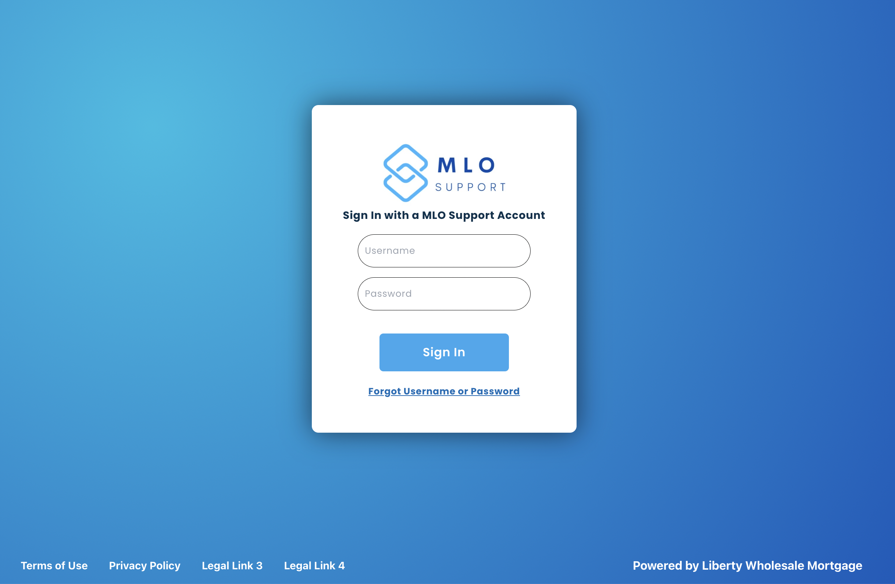
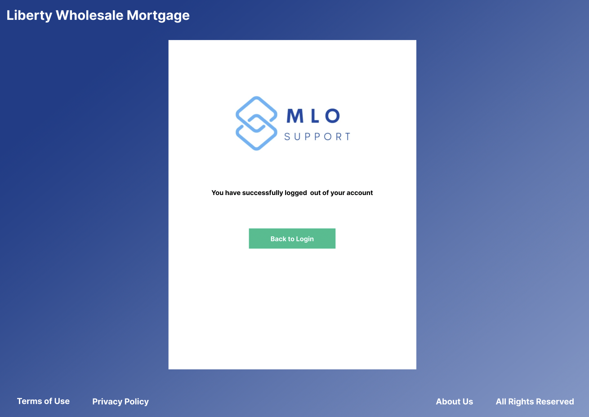
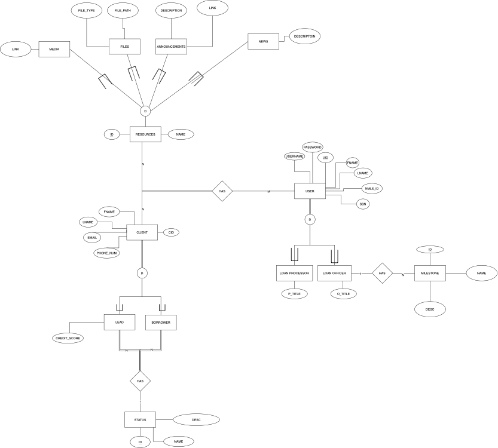

 

 
# MLO Support (Powered by Liberty Wholesale Mortgage )
  
## Table of Content
 - [Introduction](#introduction)  
 - [Solution](#solution)  
 - [Prototypes](#prototypes)  
 - [Database Models](#database-models)  
 - [Tools](#tools)  
 - [Installations](#installations)  
 - [Testing](#testing)  
 - [Timeline](#timeline)  

The "requirements.txt" file includes the following: 
Babel==2.9.1, Django==4.0.3, django-bootstrap-v5==1.0.11, djangorestframework==3.13.1 

Also install seperately: Node.js, Docker, Docker Compose, 

## Introduction
Liberty Wholesale Mortgage is a mortgage brokrage which provides finance and mortgage solutions to different types of clients. As a mortgage company, Liberty Wholesale Mortgage needs to reduce the time it takes to convert an applicant from a lead to a borrower, which includes optimizing processes and increasing staff size. An area which Liberty Wholesale Mortgage identified as an optimizable process is the communications between loan officers and loan processors. The current system is point to point telephone communication which is time-consuming and inefficient, introducing higher lead times due to a need for call backs in order to exchange information. This has directly impacted the performance of loan officers who are bottlenecked by the response times and availability of loan processors. Therefore, there is a vital need to implement a solution to increase efficiency and reduce lead times. A dashboard application will streamline the communication process between loan officers and processors, and improve process management at Liberty Wholesale Mortgage which should allow for a better and faster customer experience.

## Solution
An all in one platform for mortgage officers and loan processors to track their progress, keeping up to date with the status of their leads and borrowers, perform fillings, find lenders, and so forth.The technology lets the mortgage officers and processors to increase productivity, manage bigger pipelines and grow their business to higher levels.

## Prototypes

 Sign In 

 

 
 

 
 

 Navbar 

 
 

 Dashboard 

  
 

This would install the programs needed for this software.

On the Node.js side, you will need to install quite a few packages, navigate into the Docker file and you will see the installed Node dependencies.

 Leads 

 

 Sign Out 

 

## Database Models
Enhanced entity-relationship (EER) modeling for conceptual data modeling.

## Tools
- Visual Studio Code (IDE)
- For VSC terminal in Windows: python -m pip install -r requirements.txt
- For VSC terminal in macOS: python3 -m pip install -r requirements.txt
- which would install the following programs:
- Babel==2.9.1, Django==4.0.3, django-bootstrap-v5==1.0.11, djangorestframework==3.13.1
- Also install seperately: Docker, Docker Compose 

## Installation
### Build Instructions
- Before anything, ensure that you install all of the python dependencies using the following command:
- python -m pip install -r requirements.txt or python3 -m pip install -r requirements.txt
- On the Node.js side, you will need to install quite a few packages, navigate into the Docker file and you will see the installed Node dependencies.
- You will need to run two processes at the same time, so either use "tmux" to run them in the same terminal window, run it in two terminals, or run them in the background by adding '&' to the end of the commands.
- If you run into argon error in admin, run either python3 -m pip install argon2-cffi or python -m pip install argon2-cffi

### Docker Instructions
- Install Docker and Docker Compose
- In the directory with the docker-compose.yaml file, run docker-compose build to build the image,
and then once the image is built it can be run with docker-compose up -d. To kill the process after running it, simply do docker-compose kill
- Currently Hot Reload is not enabled, so you will need to rebuild every time you change the code, so currently use the Build Instructions, however Hot Reload is currently in development

## Testing 
- In the directory with the manage.py file, run the command in Windows: python ./manage.py runserver
- In the directory with the manage.py file, run the command in macOS: python3 ./manage.py runserver
- In the frontend directory, run the command: npm run dev
- In the frontend directory, run the following command: npm run devv

## Timeline

JIRA Milestones:

Currently, Hot Reload is not enabled, so you will need to rebuild every time you change the code, so currently use the Build Instructions. 
However, Hot Reload is currently in development. 

Sprint5: A fully functional Dashboard page is created

Sprint6: Finish the leads and borrowers database & a complete leads and borrowers page with filter function

In the directory with the manage.py file, run the command: python ./manage.py runserver (for Windows) or  python3 ./manage.py runserver (for macOS)

In the frontend directory, run the command: npm run dev

Note that you will need to run two processes at the same time, so either use "tmux" to run them in the same terminal window, run it in two terminals, or run them in the background by adding '&' to the end of the commands.

Sprint7: Dependencies installed to allow the application run on servers

Sprint8: Make the application free from vulnerabilities

Sprint9: Any additional features specified by the client is added

